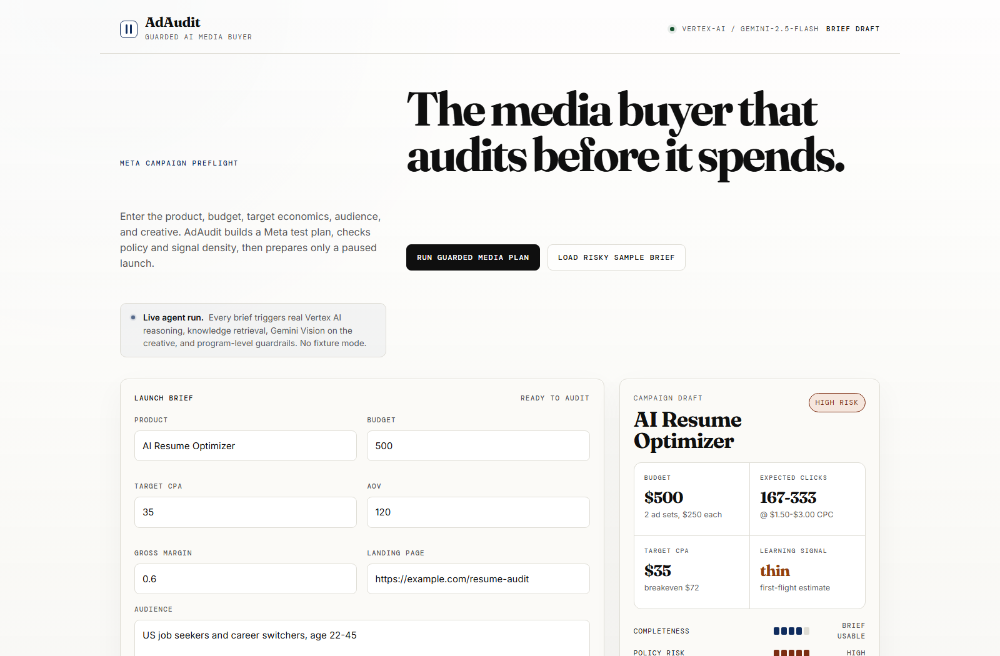
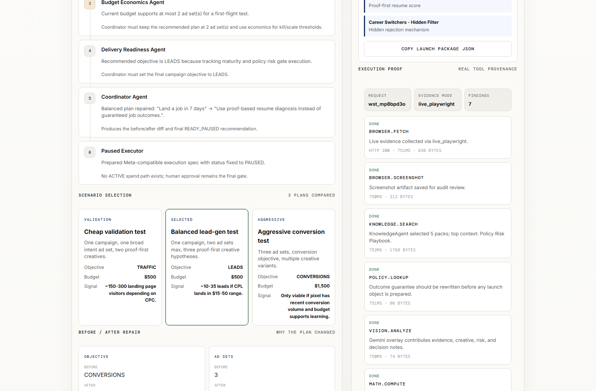
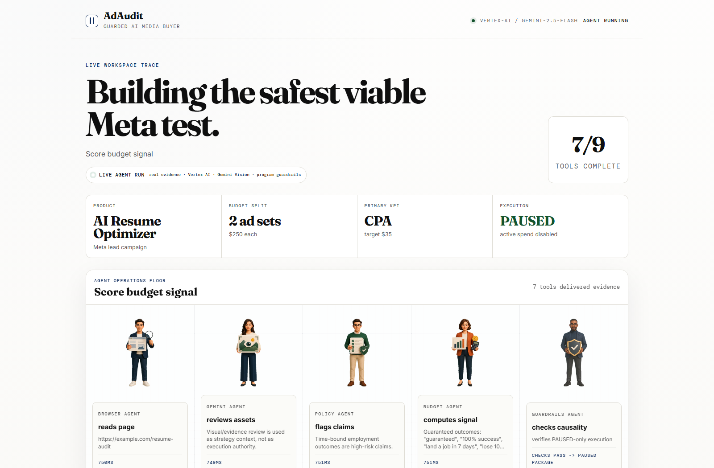
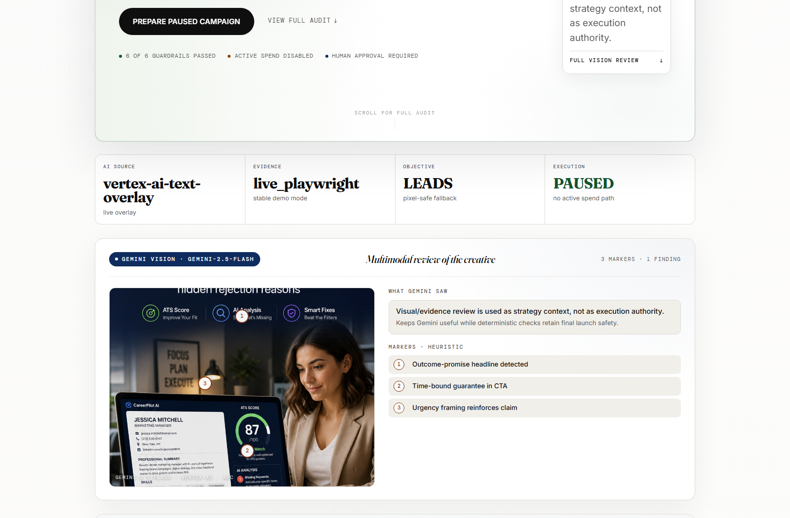

# AdAudit

**The AI media buyer that audits before it spends.**

> LLM proposes, code enforces. AdAudit compares campaign strategies, runs deterministic causal guardrails, and prepares only paused execution -- no active spend path exists.

Built for AI Agent Olympics Milan 2026. Live demo: [http://95.179.162.188:8080](http://95.179.162.188:8080)

---

## Screenshots

| Intake | Review |
|---|---|
|  |  |

| Verdict | Vision |
|---|---|
|  |  |

---

## Why AdAudit

Most AI ad tools generate copy or rush toward launch. Enterprises do not want an agent that spends money automatically. They want an agent that can explain which campaign structure is worth testing first, why a cheaper validation plan beats an aggressive conversion plan, and when tracking readiness makes spend unsafe. AdAudit turns that judgment into a working web app: Gemini proposes strategy, deterministic code enforces causal guardrails, and the final output is a Meta-compatible paused campaign spec for human approval. The agent that says no is more useful than the agent that says go.

---

## Architecture

```
User input (product, budget, CPA, AOV, margin, audience, landing page, creative image)
  |
  v
EvidenceAgent --- browser.fetch --- competitor.search --- vision.analyze
  |
  v
KnowledgeAgent --- retrieve 7 paid-media playbooks (server/knowledge/skills/)
  |
  v
MediaPlannerAgent --- 3 strategies: validation / balanced / aggressive
  |
  v
BudgetEconomicsAgent --- math.compute CPC, CPM, learning phase, CPA feasibility
  |
  v
DeliveryReadinessAgent --- policy.lookup objective x pixel x placement
  |
  v
CoordinatorAgent --- pick best strategy + rewrite risky claims + record why alternatives lose
  |
  v
6 causal guardrails (program-level assertions, not LLM self-assertions)
  +-- budget_ad_set_limit_applied
  +-- delivery_objective_applied
  +-- objective_pixel_safety
  +-- economics_safety
  +-- risky_claim_rewritten
  +-- timeline_order
  |
  v
PausedExecutor --- Meta-compatible PAUSED campaign object (no ACTIVE path)
  |
  v
Gemini Vision (gemini-2.5-flash) --- multimodal creative analysis
  |
  v
Nano Banana (gemini-2.5-flash-image) --- annotated creative image with risk markers
  |
  v
SSE stream to frontend: evidence cards, tool log, agent timeline,
  3-strategy comparison, before/after diff, 6/6 guardrail list,
  Gemini Vision findings, annotated creative
```

---

## Tech Stack

| Layer | Technology |
|---|---|
| Frontend | React 18 + Vite 8 + pure CSS (Fraunces / Inter / DM Mono type system) |
| Backend | Node 24 + native `node:http` (no Express) + `@google/genai` SDK |
| AI | Vertex AI via Application Default Credentials (ADC, not API key): gemini-2.5-flash (reasoning + Vision), gemini-2.5-flash-image (creative annotation) |
| Deployment | Vultr VM Ubuntu 24.04 + PM2 + systemd autostart |

---

## Local Development

```bash
git clone https://github.com/calebguo007/adaudit-meta-preflight
cd adaudit-meta-preflight
cp .env.example .env          # fill in AI_BASE_URL, AI_API_KEY, AI_MODEL
npm install
npm run dev                    # Vite dev server on :5173 + Node backend on :8080
```

Production-style local run:

```bash
npm run build
npm start                      # serves React build + API on PORT (default 8080)
```

Open [http://localhost:8080](http://localhost:8080).

---

## Production Deployment on Vultr

```bash
git pull origin main
npm run build
pm2 restart adaudit            # or: PORT=8080 pm2 start server/index.mjs --name adaudit
```

See [VULTR_DEPLOYMENT.md](VULTR_DEPLOYMENT.md) for full VM setup, systemd autostart, and PM2 configuration.

Health check: `curl http://95.179.162.188:8080/api/health`

---

## Environment Variables

| Variable | Description |
|---|---|
| `PORT` | Server port. Default `8080`. |
| `AI_BASE_URL` | OpenAI-compatible chat completions endpoint. Swap freely: DeepSeek gateway, Vultr Serverless, OpenRouter, or OpenAI. |
| `AI_API_KEY` | API key for the OpenAI-compatible provider. Not used when Vertex AI is active. |
| `AI_MODEL` | Model name for the OpenAI-compatible provider. Default `deepseek-v4-pro`. |
| `GOOGLE_GENAI_USE_VERTEXAI` | Set `true` to route Gemini calls through Vertex AI with ADC instead of an API key. |
| `GOOGLE_CLOUD_PROJECT` | Google Cloud project ID for Vertex AI. Required when `GOOGLE_GENAI_USE_VERTEXAI=true`. |
| `GOOGLE_CLOUD_LOCATION` | Vertex AI location. Default `global`. |
| `GEMINI_MODEL` | Gemini model for workspace reasoning and Vision. Default `gemini-2.5-flash`. |
| `NANO_BANANA_MODEL` | Gemini model for creative image annotation (image-in, image-out). Default `gemini-2.5-flash-image`. |
| `META_EXECUTOR_MODE` | Meta executor mode. Set `mock` for the public demo (paused spec, no real API calls). |

For the verified Vertex AI setup, see [GOOGLE_VERTEX_SETUP.md](GOOGLE_VERTEX_SETUP.md). The deployed Vultr instance uses ADC, not a Gemini API key.

---

## SSE Event Reference

The frontend receives a streamed sequence of Server-Sent Events from `POST /api/workspace/stream`. Each event carries an `event:` type and a `data:` JSON payload.

| Event | Payload shape |
|---|---|
| `start` | `{ request_id, endpoint_role: "canonical_workspace_trace", live: true, provider, ts }` |
| `stage_start` | `{ stage_id, label, ts }` |
| `browser_open` | `{ id, url, title, highlighted_text, screenshot_url, ts }` |
| `browser_close` | `{ id, ts }` |
| `tool_call_start` | `{ id, tool, summary, input, stage_id, ts }` |
| `tool_call_done` | `{ id, output_summary, output_full, duration_ms, size_bytes, http_status, meta_extra, ts }` |
| `tool_call_error` | `{ id, error, ts }` |
| `evidence_arrived` | `{ id, source_type, source_url, finding, impact, stage_id, ts }` |
| `vision_result_arrived` | `{ id, provider: "vertex-ai", model: "gemini-2.5-flash", summary, extracted_text, findings, policy_concerns, off_topic, ts }` |
| `vision_annotated_arrived` | `{ id, provider: "vertex-ai", model: "gemini-2.5-flash-image", image_data_url, mime_type, ts }` |
| `workspace_done` | `{ request_id, workspace, final_decision, provenance, ts }` |
| `end` | `{ ok: true, request_id, ts }` |

Legacy preflight events (`agent_start`, `agent_chunk`, `agent_done`, `agent_error`, `coordinator_done`, `coordinator_error`) are emitted by the `/api/preflight/stream` route and are not part of the canonical workspace stream.

---

## Project Structure

```
adaudit-meta-preflight/
+-- server/
|   +-- index.mjs              # HTTP server, SSE streaming, route handlers
|   +-- agents.mjs             # Agent orchestration, causal checks, workspace completion
|   +-- ai.mjs                 # AI provider client (OpenAI-compat + Vertex AI ADC)
|   +-- evidence.mjs           # Evidence collection (live fetch, knowledge fallback)
|   +-- claim-risk.mjs         # Unified claim risk rules: RISK_PATTERNS, findRiskyClaims
|   +-- knowledge.mjs          # Keyword-matched retrieval from 7 paid-media playbooks
|   +-- knowledge/skills/      # 7 playbook Markdown files
|   |   +-- budget-signal-and-economics.md
|   |   +-- creative-hypothesis-playbook.md
|   |   +-- multimodal-creative-review.md
|   |   +-- paid-media-operating-model.md
|   |   +-- platform-selection-playbook.md
|   |   +-- policy-risk-playbook.md
|   |   +-- vertical-patterns-general.md
|   +-- unit-claim-risk.mjs    # Unit tests: 7 asserts for claim risk functions
|   +-- unit-knowledge.mjs     # Unit tests: knowledge retrieval scoring
|   +-- unit-workspace-guardrails.mjs  # Unit tests: 14 asserts for causal checks + completeWorkspace
|   +-- smoke-workspace.mjs    # HTTP integration smoke test on port 18080
|   +-- smoke-vertex.mjs       # Vertex AI connectivity smoke test
+-- src/
|   +-- App.tsx                # React app: intake form, SSE consumer, verdict rendering
|   +-- App.css                # Design system (Fraunces + Inter + DM Mono, warm paper palette)
|   +-- main.tsx               # Vite entry
|   +-- assets/                # Agent SVG icons
+-- docs/
|   +-- screenshots/           # Demo screenshots for README
+-- .env.example               # Environment variable template
+-- HACKATHON_SUBMISSION.md    # Hackathon submission details
+-- VULTR_DEPLOYMENT.md        # Vultr VM deployment guide
+-- GOOGLE_VERTEX_SETUP.md     # Vertex AI + ADC setup guide
+-- Dockerfile                 # Container build (optional)
+-- package.json               # Scripts, dependencies, test chain
```

---

## Tests

```bash
npm run test
```

This runs a four-layer chain:

1. `unit-claim-risk.mjs` -- 7 asserts covering `findRiskyClaims`, `hasClaimRewrite`, `pickOriginalRiskyClaim`, `RISK_PATTERNS` extraction
2. `unit-knowledge.mjs` -- asserts for knowledge retrieval scoring and snippet extraction
3. `unit-workspace-guardrails.mjs` -- 14 asserts covering `buildCausalChecks` (6 guardrails detect failures, valid workspace passes) and `completeWorkspace` repairs (ad_set truncation, objective override, campaign sync, claim diff injection, 6/6 checks pass)
4. `smoke-workspace.mjs` -- HTTP integration test verifying the full `/api/workspace/stream` endpoint returns a coherent workspace with `final_decision` and `provenance`

Vertex AI connectivity test (requires ADC configured):

```bash
npm run smoke:vertex
```

---

## Submission

AdAudit is submitted to AI Agent Olympics Milan 2026.

- **Vultr Award** -- deployed on a Vultr VM (Ubuntu 24.04, Frankfurt). Verified URL: http://95.179.162.188:8080
- **Google Gemini Award** -- Gemini 2.5 Flash and Flash Image are used through Vertex AI with Application Default Credentials. Gemini provides live strategy overlay, multimodal creative Vision analysis, and Nano Banana image annotation. No Gemini API key is used; the deployment authenticates via ADC as specified by Google Cloud.

Full submission details: [HACKATHON_SUBMISSION.md](HACKATHON_SUBMISSION.md)

Category fit: Enterprise Utility, Agentic Workflows, Collaborative Systems, Multimodal Intelligence.

---

## Safety Boundaries

- No real ad spend. All execution objects are `PAUSED`.
- No backend route creates an `ACTIVE` campaign.
- `META_EXECUTOR_MODE=mock` labels output as dry-run shaped Meta spec.
- No fake ROAS prediction.
- Causal guardrails are program-level assertions comparing LLM output fields, not LLM self-assertions.
- `completeWorkspace` proactively repairs LLM contradictions before guardrails run.
- Human approval is required before any real platform activation.
- Live Gemini reasoning is separated from execution safety; code decides whether the workspace is coherent.

---

## License

[MIT](LICENSE)
